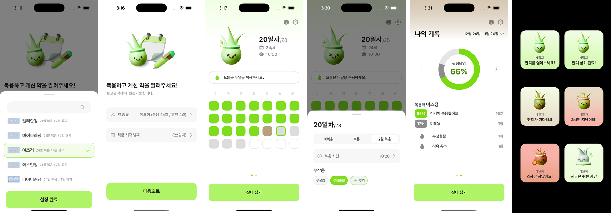

# 필링 (Pilling)

  
   
   
  <b>필링(Pilling)</b>은 <b>여성호르몬제</b>를 <b>제시간</b>에 <b>복용</b>하고, <b>간단하게 기록</b>할 수 있도록 돕는 iOS 앱입니다.
   
   
  My happy Pilling Time! Everyday is a growing.

  
  
  
  

  

## 프로젝트 개요

여성호르몬제를 규칙적으로 복용하고 기록할 수 있도록 돕는 iOS 앱입니다.  
복용일과 휴약일이 섞인 복약 규칙을 단순 체크가 아닌 상태 모델, 메시지 엔진, 위젯 연동으로 구조화해 복용 판단과 기록 흐름을 단순화했습니다.

- **핵심 기간**: 2025.01 - 2025.03
- **역할**: iOS 개발
- **배포 타겟**: iOS 16+
- **GitHub**: [Pilling-iOS](https://github.com/piriram/Pilling-iOS)
- **App Store**: [다운로드](https://apps.apple.com/kr/app/pilling/id6753967952)

## 주요 기능

- 💊 **사이클 설정** — 복용일과 휴약일을 약마다 개별 설정
- 📅 **캘린더 시각화** — 9가지 상태로 복용 이력 한눈에 확인
- 💬 **상황별 메시지** — 누락, 지연, 이중 복용에 맞는 안내 제공
- 📲 **홈 위젯** — 잠금화면에서 오늘 복용 상태 바로 확인
- 🔔 **반복 알림** — 지정 시각에 복용 알림

## 기술 스택

| 분류 | 기술 |
|------|------|
| UI / Presentation | UIKit, SnapKit, WidgetKit, Diffable Data Source |
| Architecture | MVVM, Clean Architecture, Repository Pattern |
| Reactive & State | RxSwift, NotificationCenter |
| Data Layer | CoreData, App Groups |
| Testing | XCTest, TimeProvider |

## 핵심 구현

### 1. PillStatus Enum 세분화
복용 시간 `±2시간` 허용 범위와 날짜 맥락을 반영해 복용 상태를 9가지로 세분화했다.
오늘 지연, 과거 누락, 미래 예정, 휴약기를 구분해 캘린더 색상과 메시지 로직이 같은 기준으로 동작한다.

`PillStatus` `TimeProvider` `타입 안전성` `상태 세분화`

---

### 2. 앱-위젯 간 데이터 공유
App Group + Shared CoreData Container로 앱과 위젯이 같은 저장소를 바라보게 구성했다.
기록 후 위젯이 `1초 이내` 같은 상태로 갱신된다.

`App Group` `CoreData` `WidgetKit` `TimelineProvider`

---

### 3. 메시지 우선순위 엔진
규칙을 독립 객체로 분리하고 숫자 우선순위로 첫 매칭 메시지만 반환하도록 설계했다.
누락, 지연, 이중 복용 조건이 겹쳐도 일관된 메시지를 제공한다.

`MessageRule` `우선순위` `규칙 분리` `확장성`

---

### 4. 의료 규칙 기반 단위 테스트
TimeProvider로 시간을 고정해 경계값 시나리오를 XCTest로 검증했다.
버그 `3건` 사전 발견, 디버깅 시간 `30분 → 5분`.

`XCTest` `MockTimeProvider` `경계값 테스트` `회귀 검증`

## 버전 히스토리

| 버전 | 설명 | 비고 |
|------|------|------|
| v2.0 | UIKit 기반 리팩토링 버전 | 현재 레포지토리 |
| v1.0 | SwiftUI 기반 팀 프로젝트 버전 | [이동](https://github.com/DeveloperAcademy-POSTECH/2024-MC2-M3-Pilltastic) |

## 개발자

|  |
|:---:|
| [Piri(김소람)](https://github.com/piriram) |
| iOS 개발 |

## License

MIT License
